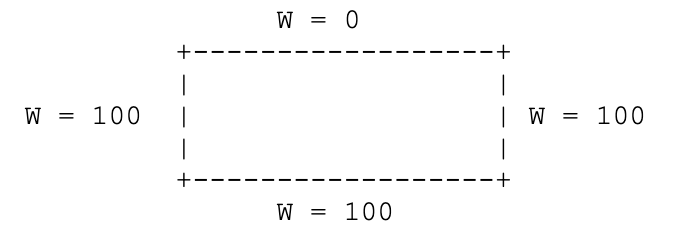
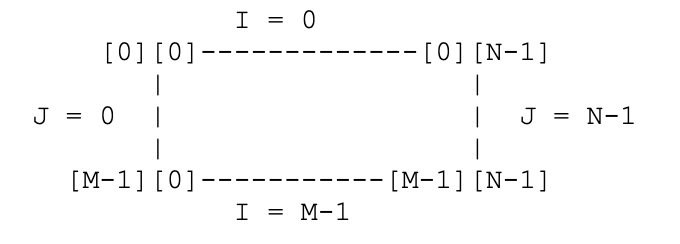

# MPI_Hotplate
A program that solves the hotplate problem using MPI.

The hotplate problem requires computing a solution for the steady
state heat equation in a 2D rectangular region.  This simple problem
is representative of a wide variety of problems which use a rectangular
grid of values and are widely applicable in many areas.
The physical region, and the boundary conditions, are described by
this diagram:

Note that 0 and 100 are merely sample temperatures.
A common way to initialize the interior points of the grid is to set them
all to the average of all the values along the edges.  As the computation
progresses, the interior points are altered as described below.
However, the values along the edges never change.

The region is covered with a grid of M by N nodes, and an M by N array
named W is used to record the temperature.  The correspondence between
array indices and locations in the region is suggested by giving the
indices of the four corners:

The steady state solution to the discrete heat equation satisfies the
following condition at an interior grid point:
  W[Current] = (1/4) * ( W[North] + W[South] + W[East] + W[West] )

where "Current" is the index of the current grid point currently being
considered, "North" is the index of its immediate neighbor to the "north",
and so on.

Given an approximate solution of the steady state heat equation, a
"better" solution is given by replacing each interior point by the
average of its 4 neighbors - in other words, by using the condition
as an ASSIGNMENT statement:

        W[Current] = (1/4) * ( W[North] + W[South] + W[East] + W[West] )

As discussed above, the values along the edges never change.

If this process is repeated often enough, the difference between
successive estimates of the solution will approach zero.  The user will
specify a value typically called epsilon which is the error tolerance
used to halt the iteration.  The program will halt when successive iterations
yield no changes larger than epsilon at any grid point.

